# 📊 Unemployment Analysis with Python | OIBSIP Task 2

## 📌 Objective
Analyze unemployment trends across Indian states during the COVID-19 pandemic, comparing Rural vs Urban patterns, Pre-COVID vs During-COVID shifts, and identifying the hardest-hit regions.

---

## 📁 Dataset
- **Records:** 768 rows (740 after cleaning)
- **Key Columns:** State, Date, Estimated Unemployment Rate (%), Estimated Employment, Labour Participation Rate (%), Area (Rural/Urban)
- **Time Period:** 2019 – 2020
- **Source:** Unemployment in India dataset

---

## 🧹 Data Cleaning
- Removed fully blank/NaN rows → reduced from 768 to 740 records
- Converted Date column to proper datetime format
- Fixed inconsistent column names
- Dropped single-value categorical column (noise data)
- Retained outliers intentionally — high unemployment spikes during lockdown are real data points, not errors

---

## 🔍 Key EDA Findings

### Distribution Analysis
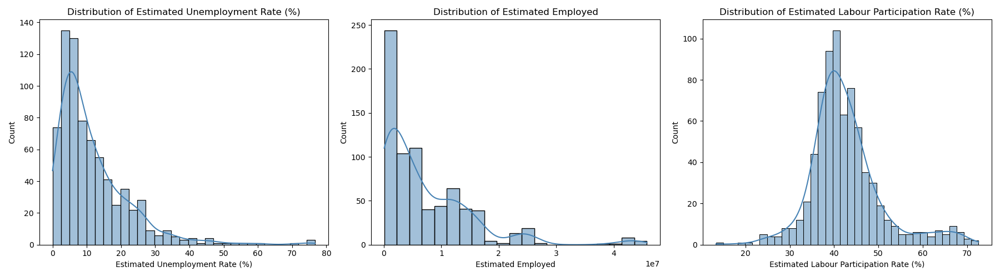

### Average Unemployment Rate by State
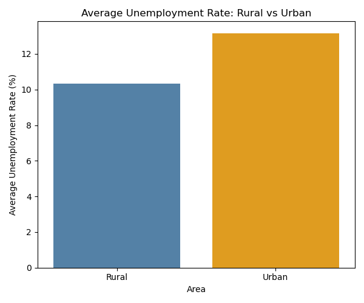

### Top 10 States with Highest Unemployment
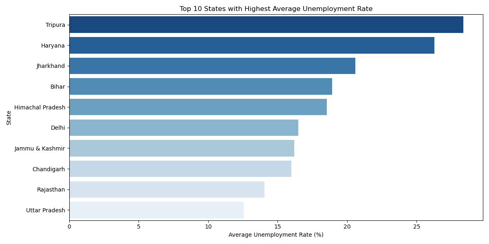

### Estimated Employment by State


### Unemployment Rate — Rural vs Urban by Region
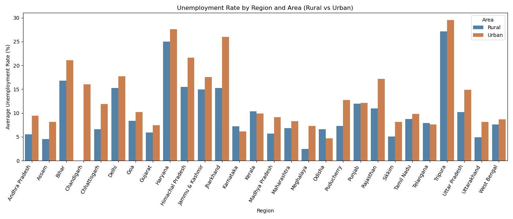

---

## 📈 Rural vs Urban Trends
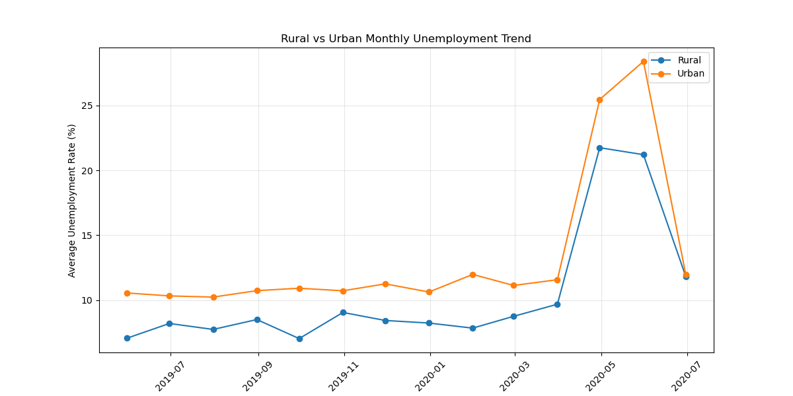

---

## 🔗 Correlation Analysis

### Overall Correlation Heatmap
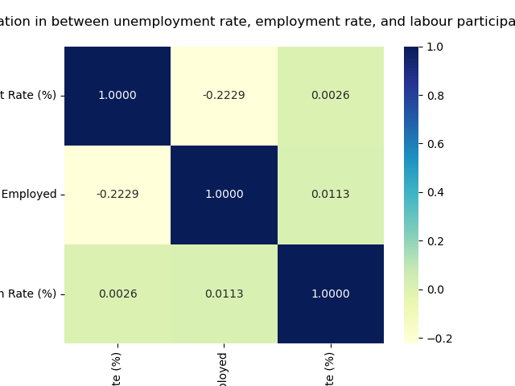

### Rural Correlation
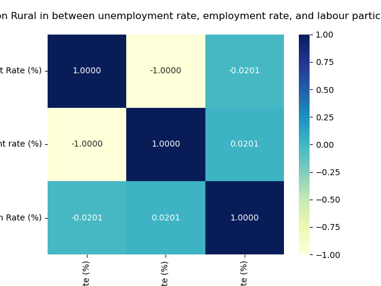

### Urban Correlation
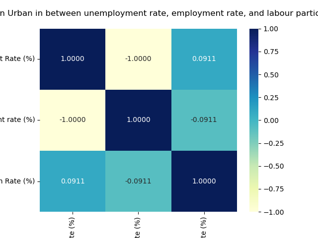

**Key Insight:**
- **Rural areas:** Labour Participation Rate has near-zero correlation with Unemployment Rate (-0.02) — when jobs disappear, people stop looking (discouragement effect)
- **Urban areas:** When one person loses a job, someone else in the family steps up and starts looking for work

---

## 🦠 Pre-COVID vs During-COVID Impact

### Unemployment Comparison (2019 vs 2020)
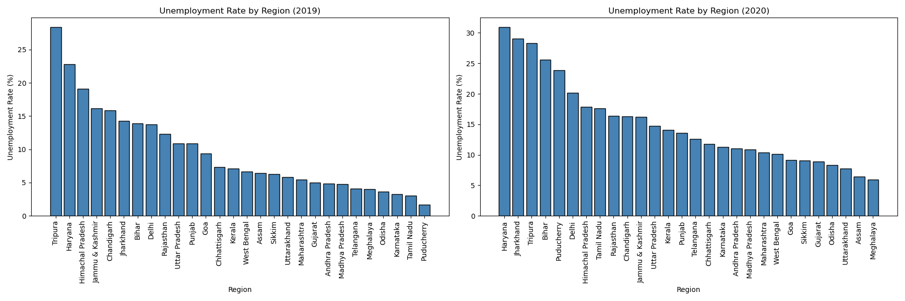

### Pre-COVID vs During-COVID — Overall
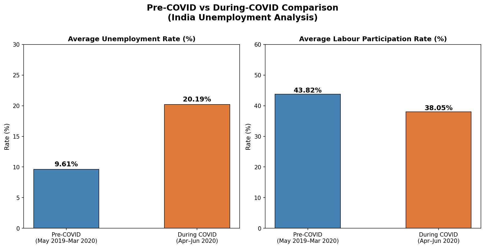

### Pre-COVID vs During-COVID — Rural & Urban Split
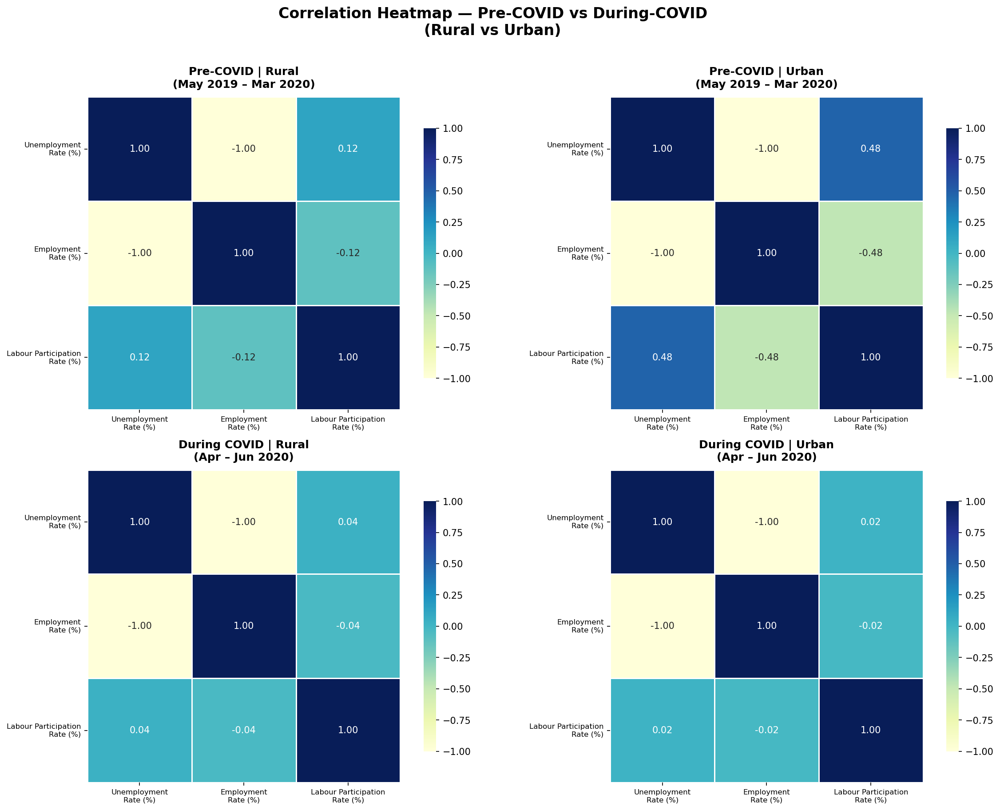

**Key Numbers:**
- Unemployment nearly **doubled** — from **9.61%** (Pre-COVID) to **20.19%** (During COVID)
- Labour Participation dropped from **43.82%** to **38.05%** (a 6 percentage point fall)

---

## 📉 Time-Series Analysis — Major States
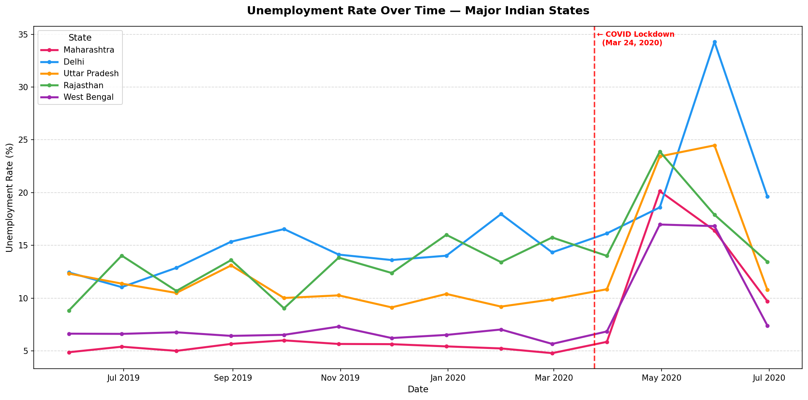

- Before COVID, every state was stable
- After **March 24, 2020** — the spike is universal, no exceptions
- **Delhi** hit the worst at nearly **35%** unemployment
- **Rajasthan** and **UP** reached approximately **25%**
- Post-spike, rates gradually began recovering

---

## 💡 Key Insights
1. **COVID-19 doubled India's unemployment rate** — from ~9.6% to ~20.2%
2. **Rural vs Urban behave differently** — rural workers exit the labour force entirely (discouragement), while urban families add new job seekers
3. **Delhi was the hardest-hit state** at ~35% peak unemployment
4. **Outliers were real signals** — high spikes during lockdown are genuine, not data errors
5. **Labour Participation and Unemployment are decoupled in rural India** — driven by seasonal agricultural cycles, not job availability

---

## 📂 Project Files

```
📁 DataScience-Task2-UnemploymentAnalysis/
├── Notebook.ipynb    → Complete analysis notebook
├── Data.csv          → Dataset
├── images/           → All visualizations (13 plots)
└── README.md         → Project documentation
```

---

## 🛠️ Tech Stack


| Library | Purpose |
|---|---|
| `pandas` | Data loading, cleaning, manipulation |
| `numpy` | Numerical operations |
| `matplotlib` | Plotting and visualization |
| `seaborn` | Statistical visualizations |

---

## 🚀 How to Run

```bash
# 1. Clone or download the project
# 2. Install dependencies
pip install numpy pandas matplotlib seaborn

# 3. Open the notebook in Jupyter
jupyter notebook Notebook.ipynb
```

---

*Submitted as part of OIBSIP (OASIS InfoByte Internship Program) — Data Science Task 2*
