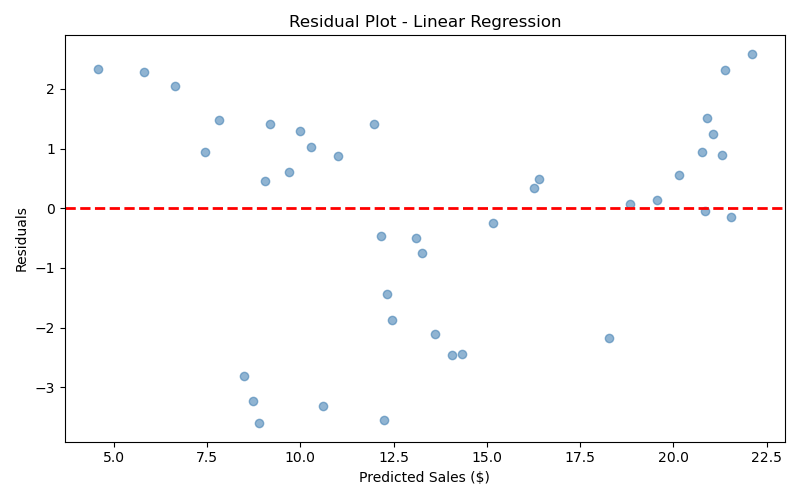
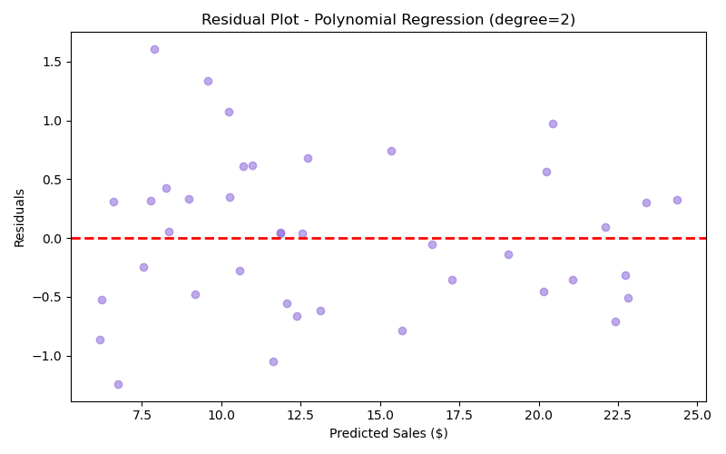
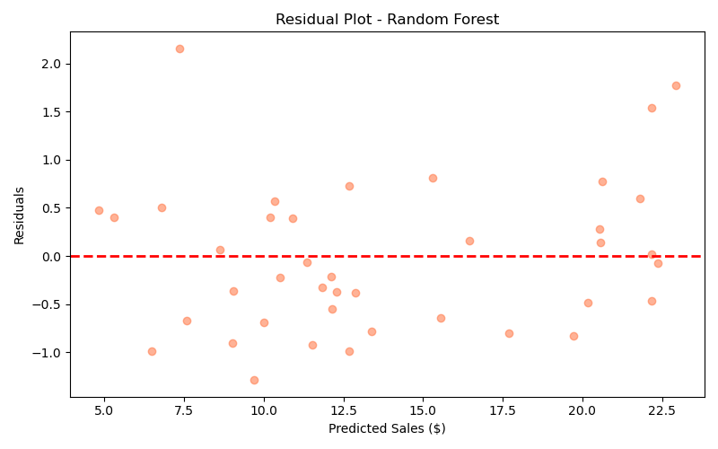
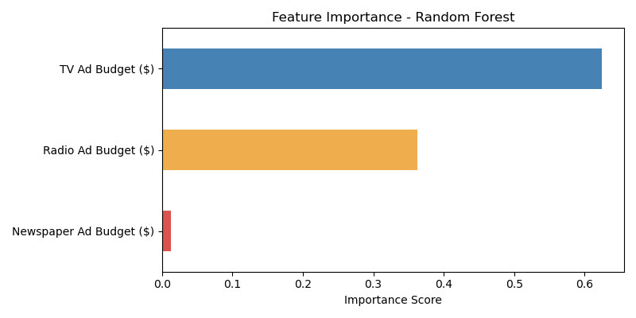
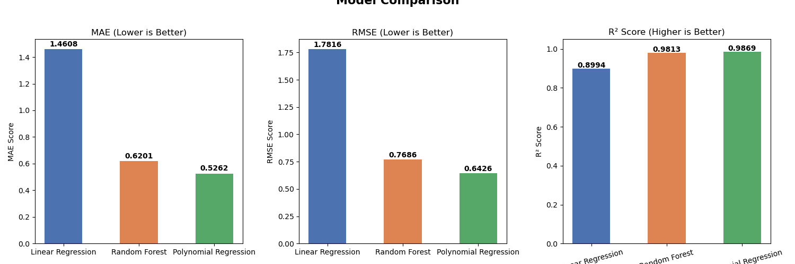

# 📊 Sales Prediction Using Python | OIBSIP Task 5

## 📌 Objective
Predict product sales based on advertising budgets across TV, Radio, and Newspaper channels using Machine Learning regression models.

---

## 📁 Dataset
- **Records:** 200 rows
- **Columns:** 4 (TV Ad Budget, Radio Ad Budget, Newspaper Ad Budget, Sales)
- **Source:** Advertising Budget and Sales dataset
- **Target Variable:** Sales ($)

---

## 🔍 Key EDA Findings
- **TV Ad Budget** has the strongest correlation with Sales (≈ 0.78) — dominant predictor
- **Radio Ad Budget** has moderate correlation (≈ 0.58) — useful feature
- **Newspaper Ad Budget** shows weak correlation (≈ 0.23) — identified as low-value feature
- **No multicollinearity** between features — ideal for Linear Regression
- Newspaper Ad Budget is **right-skewed** (skew ≈ 0.89) with a few large outliers

---

## 🧪 Experiment: Feature Selection Impact

I trained all models **twice** to study the impact of the weak Newspaper feature:

| Notebook | Features Used | Description |
|---|---|---|
| `notebook.ipynb` | TV + Radio + Newspaper (3 features) | Baseline experiment |
| `Model_2nd.ipynb` | TV + Radio only (2 features) | After dropping weak feature |

### 📈 Results Comparison — With vs Without Newspaper

| Model | With Newspaper (3 features) | Without Newspaper (2 features) | Improvement |
|---|---|---|---|
| **Linear Regression** | R²=0.8994, RMSE=1.7816 | R²=0.9006, RMSE=1.7714 | ✅ Slight |
| **Random Forest** | R²=~0.95, RMSE=0.7686 | R²=0.9864, RMSE=0.6550 | ✅ Good |
| **Polynomial Regression** | R²=0.9813, RMSE=0.7686 | R²=0.9885, RMSE=0.6035 | ✅ Best |

> **Key Finding:** Removing the weak Newspaper feature improved all model scores, confirming that feature selection plays a crucial role in ML pipelines.

---

## 📊 Final Model Results (Best Experiment — 2 Features)

| Model | MAE | RMSE | R² |
|---|---|---|---|
| Linear Regression | 1.4443 | 1.7714 | 0.9006 |
| Random Forest | 0.5391 | 0.6550 | 0.9864 |
| **Polynomial Regression** | **0.4935** | **0.6035** | **0.9885** |

---

## 🏆 Best Model: Polynomial Regression (degree=2)
- **Highest R² Score:** 0.9885 — explains **98.85% of variance** in Sales
- **Lowest RMSE:** 0.6035 — average prediction error of only \$0.60
- Outperforms both Linear Regression and Random Forest across all metrics

---

## 📉 Model Visualizations

### Linear Regression (Base Model)


### Polynomial Regression (Best Model)


### Random Forest Regression


### Feature Importance — Random Forest


### Model Comparison


---

## 💡 Key Insights
1. **TV advertising has the highest impact on sales** — confirmed by correlation analysis and Random Forest feature importance
2. **Removing Newspaper Ad Budget improved all models** — weak features add noise, not value
3. **Polynomial Regression captured non-linear patterns** better than plain Linear Regression
4. **Residual plots** for all models showed random scatter around zero — no systematic bias

---

## 📂 Project Files

```
📁 DataScience-Task5-SalesPrediction/
├── notebook.ipynb                    → Experiment 1: All 3 features (TV + Radio + Newspaper)
├── Model_2nd.ipynb                   → Experiment 2: TV + Radio only (best results)
├── Advertising Budget and Sales.csv  → Dataset
├── images/                           → Model visualizations (5 plots)
└── README.md                         → Project documentation
```

---

## 🛠️ Tech Stack


| Library | Purpose |
|---|---|
| `pandas` | Data loading, cleaning, manipulation |
| `numpy` | Numerical operations |
| `matplotlib` | Plotting and visualization |
| `seaborn` | Statistical visualizations |
| `scikit-learn` | Machine Learning models and metrics |

---

## 🚀 How to Run

```bash
# 1. Clone or download the project
# 2. Install dependencies
pip install numpy pandas matplotlib seaborn scikit-learn

# 3. Open either notebook in Jupyter
jupyter notebook notebook.ipynb
# or
jupyter notebook Model_2nd.ipynb
```

---

*Submitted as part of OIBSIP (OASIS InfoByte Internship Program) — Data Science Task 5*
